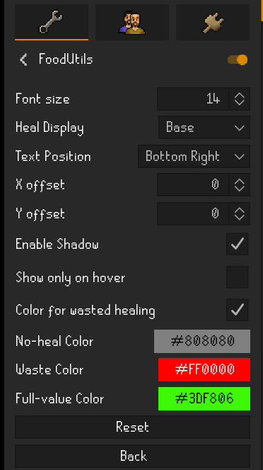
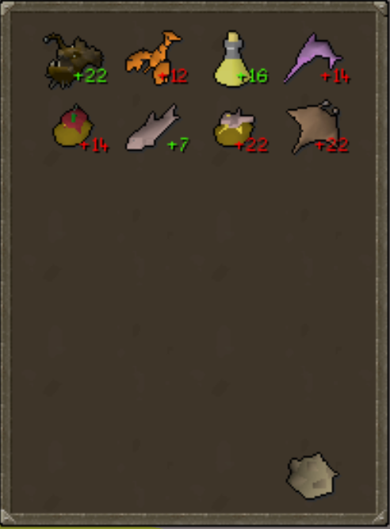
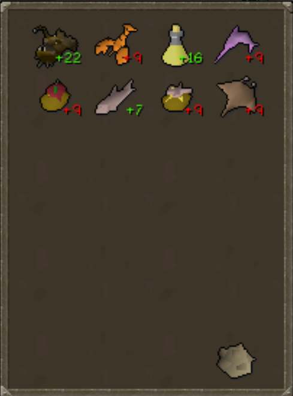
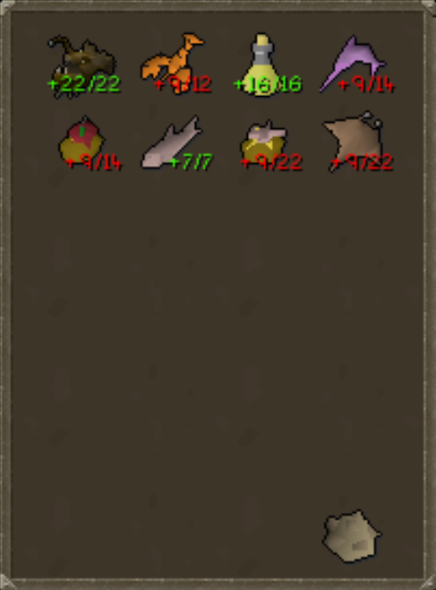

# FoodUtils

A quality-of-life RuneLite external plugin that displays how much HP food will restore directly on inventory items.

## Features

- Displays healing values on food items in your inventory
- Shows:
  - Base heal
  - Effective heal
  - Both (configurable)
- Color indicators for:
  - Full heal
  - Wasted heal
  - No heal
- Supports special healing mechanics:
  - Standard food
  - Anglerfish (overheal logic)
  - Saradomin brews

## Customization

- Multiple text positions:
  - Top left / Top right
  - Middle left / Middle right
  - Bottom left / Bottom right
- Adjustable font size
- X and Y offset for fine positioning
- Optional hover-only display mode

## Menu

## Base Healing Display Mode

## Effective Healing Display Mode
- Note HP is 99 but currently 90 due to rock cake usage

## Both Healing Display Mode
